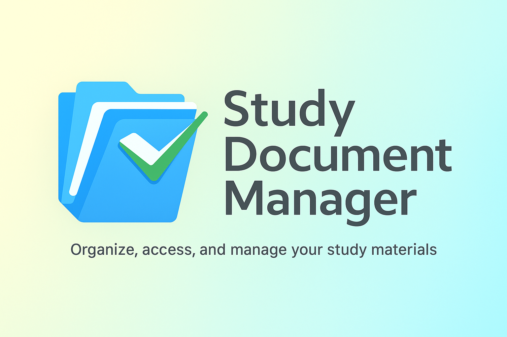

<div align="center">



> **Quản lý tài liệu cá nhân - Đơn giản, Hiệu quả, Riêng tư**

[](https://dotnet.microsoft.com/)
[](https://www.sqlite.org/)
[](https://docs.microsoft.com/dotnet/desktop/winforms/)
[](https://github.com/hayato-shino05/study-document-manager/releases)
[](LICENSE)

</div>

## Giới thiệu

**Study Document Manager** là ứng dụng Windows Forms (C#) giúp bạn tổ chức tài liệu học tập và công việc theo phong cách **Personal Mode** (cá nhân hóa).

Ứng dụng hoạt động hoàn toàn **Offline**, sử dụng **SQLite** làm cơ sở dữ liệu cục bộ, không yêu cầu cài đặt SQL Server phức tạp và không cần đăng nhập. Chỉ cần tải về và chạy!

> 📂 [Xem cấu trúc dự án](PROJECT_STRUCTURE.md)

### Tính năng nổi bật

- 🚀 **Portable & Offline**: Chạy ngay không cần cài đặt database server. Dữ liệu lưu trong file `.db` cục bộ.
- 📂 **Quản lý tài liệu**: Thêm, sửa, xóa, tìm kiếm nhanh theo tên, danh mục, loại.
- 🎨 **Giao diện hiện đại**: Theme Teal/Emerald phẳng, đẹp mắt, Toast Notification mượt mà.
- 🏷️ **Phân loại thông minh**: Sắp xếp theo Môn học (Subject), Loại file (PDF, Word...), Bộ sưu tập (Collections).
- ⭐ **Đánh dấu quan trọng**: Ghim các tài liệu ưu tiên.
- 🔍 **Bộ lọc mạnh mẽ**: Lọc theo ngày, dung lượng, trạng thái, từ khóa.
- 📊 **Thống kê trực quan**: Biểu đồ phân bố tài liệu, timeline hoạt động.
- 📤 **Xuất dữ liệu**: Xuất danh sách tài liệu ra file CSV.
- 📝 **Ghi chú cá nhân**: Thêm ghi chú và trạng thái riêng cho từng tài liệu.
- ⏰ **Quản lý Deadline**: Theo dõi tài liệu sắp đến hạn và quá hạn.
- 🔄 **Tự động cập nhật**: Kiểm tra phiên bản mới từ GitHub Releases.
- 🧹 **Kiểm tra file rác**: Tự động phát hiện các liên kết file bị hỏng (file đã xóa khỏi ổ cứng).

---

## Giao diện & Trải nghiệm

### Dashboard chính
- Menu bar và Toolbar truy cập nhanh.
- Danh sách tài liệu dạng lưới (Grid) với icon trực quan.
- Panel tìm kiếm và bộ lọc (Filter) tiện lợi bên trái.
- Các nút thao tác nhanh: Thêm, Sửa, Xóa, Mở file.

### Thêm/Sửa tài liệu
- Tự động điền tên và tính dung lượng file khi chọn file từ máy tính.
- Gắn thẻ (Tag), chọn danh mục, thêm ghi chú cá nhân.

### Thống kê (Reports)
- Tổng quan số lượng tài liệu.
- Biểu đồ tròn (Pie Chart) phân bố theo môn học/loại.
- Biểu đồ cột (Bar Chart) timeline thêm tài liệu.

### Notification System
- Hệ thống thông báo **Toast** hiện đại, không làm gián đoạn công việc (Non-blocking).
- 4 trạng thái: Success (Xanh), Error (Đỏ), Warning (Cam), Info (Lam).

---

## Cài đặt và Chạy

### Yêu cầu hệ thống
- Windows 7/8/10/11.
- .NET Framework 4.8 Runtime.

### Hướng dẫn chạy (Run)
1. **Clone repository**:
   ```bash
   git clone https://github.com/hayato-shino05/study-document-manager.git
   cd study-document-manager
   ```
2. **Mở project**:
   - Mở file `study-document-manager.sln` bằng Visual Studio 2019/2022.
3. **Build & Run**:
   - Nhấn `F5` hoặc nút **Start**.
   - Database SQLite sẽ tự động được khởi tạo tại `bin/Debug/data/study_documents.db`.

---

## Công nghệ sử dụng

- **Ngôn ngữ**: C# (.NET Framework 4.8)
- **UI Framework**: Windows Forms (WinForms)
- **Database**: SQLite (System.Data.SQLite)
- **Biểu đồ**: System.Windows.Forms.DataVisualization
- **Architecture**: MVP (Model-View-Presenter), Repository Pattern

---

## Đóng góp

Mọi đóng góp đều được chào đón!
1. Fork dự án.
2. Tạo branch mới (`git checkout -b feature/AmazingFeature`).
3. Commit thay đổi (`git commit -m 'Add some AmazingFeature'`).
4. Push lên branch (`git push origin feature/AmazingFeature`).
5. Tạo Pull Request.

---

## Tác giả

**hayato-shino05**
- Email: [hayatoshino05@gmail.com](mailto:hayatoshino05@gmail.com)
- GitHub: [@hayato-shino05](https://github.com/hayato-shino05)

---

<div align="center">
Made with ❤️ by hayato-shino05 | © 2025
</div>
